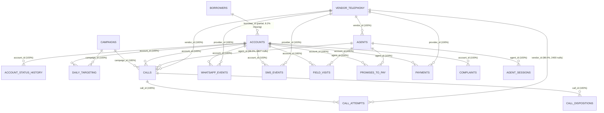

# Data Inventory

## 1. Executive Summary

This document establishes a comprehensive, read-only data discovery and inventory baseline for the Collections Recovery analytics engagement. The objective of Phase 0 is to dynamically inspect and profile every raw dataset, audit schema and referential integrity against the data dictionary, map candidate entity relationships, and catalog initial forensic signals before any data cleaning, transformation, or recovery metric calculations take place.

- **Total Datasets**: 17 relational CSV datasets and 1 supporting data dictionary (`data_dictionary.csv`), totaling 18 raw files.
- **Total Record Volume**: 639,185 operational and dimension records across the 17 core datasets (639,328 records including the data dictionary).
- **Total Raw Footprint**: Approximately 62.54 MB (65,584,163 bytes across all 18 CSV files).
- **Overall Temporal Coverage**: Account origination spans from **January 1, 2024 to November 30, 2025** (23 months of master account history). Operational intervention activity (calls, messages, field visits, PTPs, payments, and complaints) spans from **December 29, 2025 to August 12, 2026**, with primary operational records concentrated between **January 1, 2026 and August 8, 2026** (an incomplete 8th month). Future commitment dates (PTP promise dates and complaint resolutions) extend through September 6, 2026.
- **Major Core Entities**: Borrowers (`borrowers`), Loan Accounts (`accounts`), Collection Agents (`agents`), Telephony Vendors (`vendor_telephony`), Campaigns (`campaigns`), Daily Allocations (`daily_targeting`), Voice Engagements (`calls`, `call_attempts`, `call_dispositions`), Digital Engagements (`whatsapp_events`, `sms_events`), Field Engagements (`field_visits`), Commitments (`promises_to_pay`), Financial Transactions (`payments`), Grievances (`complaints`), and Audit State Transitions (`account_status_history`).
- **Major Initial Data-Quality Signals**:
  1. *Exact Row Duplication*: Injected duplicate rows exist across 4 tables (`borrowers`: 600, `calls`: 1,271, `payments`: 486, `whatsapp_events`: 600) totaling 2,957 exact duplicate rows.
  2. *Duplicate Transaction Identifiers*: In `payments.csv`, 500 duplicate `payment_id`s (1,000 rows) and 8,424 rows sharing `payment_reference`s are present; in `calls.csv`, 1,350 duplicate `call_id`s (2,700 rows) are present.
  3. *Entity Resolution & Multi-Record Entities*: `agents.csv` contains 30,000 rows for exactly 1,000 unique `agent_id`s and 1,099 `employee_code`s (Slowly Changing Dimension / multi-state audit log pattern). `borrowers.csv` contains 30,000 unique rows for 11,015 unique `borrower_id`s, where different individuals and geographies share identical borrower IDs.
  4. *Referential Integrity Gaps*: 455 accounts have `NULL` `borrower_id`, and 2,458 account records (as well as 800–980 borrower IDs across operational event tables) reference 897 unique borrower IDs that do not exist in `borrowers.csv`.
  5. *Orphaned Foreign Keys & Nulls*: `calls.agent_id` contains 1,827 null values; `call_attempts.vendor_id` contains 2,400 null values.
  6. *Payment Status Heterogeneity*: `payments.csv` contains 17,880 `SUCCESS`, 3,744 `FAILED`, 2,592 `PENDING`, and 1,284 `REVERSED` records, confirming that unvalidated summing of payment amounts will drastically distort gross vs. net collections.
  7. *Multi-Timezone Confounding*: Timezone indicators across `accounts`, `calls`, `agent_sessions`, and `vendor_telephony` are split across `UTC`, `Asia/Kolkata` (+05:30), and `Asia/Dubai` (+04:00).
  8. *Temporal Inconsistencies*: In `account_status_history.csv`, `recorded_at` precedes `event_at` in approximately 50% of the records by up to 24 hours.

> [!IMPORTANT]
> **Phase 0 Scope Constraint**: All analyses below represent read-only exploratory discovery. No data has been modified, deduplicated, imputed, or transformed. No business performance metrics, recovery rates, or investment evaluations have been calculated.

## 2. Dataset Inventory

The table below catalogs all 17 relational datasets discovered dynamically in `data/`, detailing physical dimensions, date spans, duplicate percentages, and cell-level missingness.

| Dataset | Rows | Columns | Date Range | Duplicate % | Missing % | Notes |
| :--- | :--- | :--- | :--- | :--- | :--- | :--- |
| `account_status_history` | 60,000 | 8 | 2025-12-31 to 2026-08-09 | 0.00% | 0.00% | Audit log of account lifecycle states; recorded_at precedes event_at in some records |
| `accounts` | 30,000 | 11 | 2024-01-01 to 2025-11-30 | 0.00% | 0.14% | Master loan account grain; contains loan balance, DPD, risk tiers, and 455 null borrower_ids |
| `agent_sessions` | 15,000 | 7 | 2026-01-01 to 2026-08-09 | 0.00% | 0.00% | Telephony login/logout session logs; duration and channel tracking |
| `agents` | 30,000 | 8 | 2024-01-01 to 2026-08-03 | 0.00% | 0.00% | Agent dimension containing historical updates (30 records per agent_id; 1,099 employee codes) |
| `borrowers` | 30,600 | 8 | 2025-01-01 to 2026-08-03 | 1.96% | 0.62% | Borrower master entity; contains 600 exact dups and multi-profile collisions per borrower_id |
| `call_attempts` | 120,000 | 9 | 2026-01-01 to 2026-08-08 | 0.00% | 0.22% | Granular dialer attempt logs; includes 2,400 null vendor_ids |
| `call_dispositions` | 35,000 | 8 | 2026-01-01 to 2026-08-08 | 0.00% | 0.00% | Disposition outcomes across 3 taxonomy versions (legacy, v1, v2) |
| `calls` | 91,350 | 11 | 2025-12-29 to 2026-08-12 | 1.39% | 0.18% | Master call transaction table; contains 1,271 exact dups and 1,827 null agent_ids |
| `campaigns` | 120 | 7 | 2026-01-01 to 2026-08-16 | 0.00% | 0.00% | Campaign configuration and strategy rules; spans legacy, v1, v2, v3 strategies |
| `complaints` | 8,000 | 9 | 2026-01-01 to 2026-08-26 | 0.00% | 0.00% | Customer grievances across 7 categories; contains full resolution timestamps |
| `daily_targeting` | 45,000 | 7 | 2026-01-01 to 2026-08-08 | 0.00% | 0.00% | Daily account-level targeting allocations and recommended channels |
| `field_visits` | 25,000 | 10 | 2025-12-31 to 2026-08-08 | 0.00% | 0.10% | Physical field executive visits with GPS coordinates; 250 null scheduled_at dates |
| `payments` | 25,500 | 9 | 2026-01-01 to 2026-08-08 | 1.91% | 0.17% | Transaction ledger; contains 486 exact dups, 500 duplicate payment_ids, and 4 settlement statuses |
| `promises_to_pay` | 18,000 | 9 | 2026-01-01 to 2026-09-06 | 0.00% | 0.00% | Commitments to pay across 4 collection channels; promise dates extend to Sep 2026 |
| `sms_events` | 45,000 | 8 | 2026-01-01 to 2026-08-08 | 0.00% | 0.00% | Digital SMS delivery events across 4 lifecycle states and 4 message templates |
| `vendor_telephony` | 15 | 6 | N/A (Dimension) | 0.00% | 0.00% | Static vendor dimension cataloging 15 telephony and BPO vendor configurations |
| `whatsapp_events` | 60,600 | 8 | 2026-01-01 to 2026-08-08 | 0.99% | 0.00% | Digital WhatsApp engagement events across 6 lifecycle stages; 600 exact dups |

*Note: `data_dictionary.csv` (143 rows, 3 columns, 4.58 KB) serves as the 18th file in the data package.*

## 3. Schema Summary

The tables below detail all 143 columns across the 17 operational datasets. Documented data types from `data_dictionary.csv` are compared against observed pandas storage types, null percentages, and unique value counts.

### 3.1 `account_status_history`

**Total Records**: 60,000 | **Total Attributes**: 8

| Dataset | Column | Data Type (Actual) | Data Type (Dict) | Null % | Unique Count | Description |
| :--- | :--- | :--- | :--- | :--- | :--- | :--- |
| `account_status_history` | `history_id` | `object` | `object` | 0.00% | 60,000 | Unique status change audit log identifier |
| `account_status_history` | `account_id` | `object` | `object` | 0.00% | 25,999 | Foreign key referencing loan account |
| `account_status_history` | `borrower_id` | `object` | `object` | 0.00% | 11,916 | Foreign key referencing borrower |
| `account_status_history` | `event_at` | `object` | `datetime64[ns]` | 0.00% | 59,898 | Operational timestamp of status transition |
| `account_status_history` | `status` | `object` | `object` | 0.00% | 7 | Target state (ACTIVE, PTP, DELINQUENT, NPA, PAID, CLOSED, WRITEOFF) |
| `account_status_history` | `changed_by` | `object` | `object` | 0.00% | 101 | System service or user ID initiating transition |
| `account_status_history` | `source` | `object` | `object` | 0.00% | 5 | Subsystem trigger (CORE, BATCH, CALL, FIELD, PAYMENT) |
| `account_status_history` | `recorded_at` | `object` | `datetime64[ns]` | 0.00% | 59,906 | Database physical commit timestamp |

### 3.2 `accounts`

**Total Records**: 30,000 | **Total Attributes**: 11

| Dataset | Column | Data Type (Actual) | Data Type (Dict) | Null % | Unique Count | Description |
| :--- | :--- | :--- | :--- | :--- | :--- | :--- |
| `accounts` | `account_id` | `object` | `object` | 0.00% | 30,000 | Unique loan account identifier |
| `accounts` | `borrower_id` | `object` | `object` | 1.52% | 10,943 | Foreign key referencing borrower profile |
| `accounts` | `loan_type` | `object` | `object` | 0.00% | 5 | Credit product classification (CREDIT_CARD, PERSONAL, AUTO, etc.) |
| `accounts` | `principal_amount` | `float64` | `float64` | 0.00% | 29,996 | Initial sanctioned loan principal amount (INR) |
| `accounts` | `outstanding_amount` | `float64` | `float64` | 0.00% | 29,994 | Current unpaid balance on the account (INR) |
| `accounts` | `dpd` | `int64` | `int64` | 0.00% | 11 | Days Past Due at observation / account opening |
| `accounts` | `risk_segment` | `object` | `object` | 0.00% | 4 | Risk categorization (HIGH, MEDIUM, LOW, NPA) |
| `accounts` | `status` | `object` | `object` | 0.00% | 4 | Current account operational status (ACTIVE, CLOSED, PAID, WRITEOFF) |
| `accounts` | `opened_at` | `object` | `datetime64[ns]` | 0.00% | 29,993 | Timestamp when account was originated |
| `accounts` | `timezone` | `object` | `object` | 0.00% | 3 | Reported operational timezone of account record |
| `accounts` | `schema_version` | `object` | `object` | 0.00% | 3 | Data schema version of account record (v1, v2, v3) |

### 3.3 `agent_sessions`

**Total Records**: 15,000 | **Total Attributes**: 7

| Dataset | Column | Data Type (Actual) | Data Type (Dict) | Null % | Unique Count | Description |
| :--- | :--- | :--- | :--- | :--- | :--- | :--- |
| `agent_sessions` | `session_id` | `object` | `object` | 0.00% | 15,000 | Unique telephony/work session identifier |
| `agent_sessions` | `agent_id` | `object` | `object` | 0.00% | 1,000 | Foreign key referencing agent |
| `agent_sessions` | `login_at` | `object` | `datetime64[ns]` | 0.00% | 14,996 | Session start timestamp |
| `agent_sessions` | `channel` | `object` | `object` | 0.00% | 4 | Session contact channel (VOICE, CHAT, BLENDED) |
| `agent_sessions` | `device_id` | `object` | `object` | 0.00% | 1,500 | Hardware device identifier |
| `agent_sessions` | `timezone` | `object` | `object` | 0.00% | 2 | Session operational timezone |
| `agent_sessions` | `logout_at` | `object` | `datetime64[ns]` | 0.00% | 14,996 | Session termination timestamp |

### 3.4 `agents`

**Total Records**: 30,000 | **Total Attributes**: 8

| Dataset | Column | Data Type (Actual) | Data Type (Dict) | Null % | Unique Count | Description |
| :--- | :--- | :--- | :--- | :--- | :--- | :--- |
| `agents` | `agent_id` | `object` | `object` | 0.00% | 1,000 | Collection agent identifier |
| `agents` | `employee_code` | `object` | `object` | 0.00% | 1,099 | Internal HR employee code |
| `agents` | `agent_name` | `object` | `object` | 0.00% | 10 | Agent full name |
| `agents` | `vendor_id` | `object` | `object` | 0.00% | 15 | Foreign key referencing agency / BPO telephony vendor |
| `agents` | `team` | `object` | `object` | 0.00% | 5 | Operational collection team assignment |
| `agents` | `status` | `object` | `object` | 0.00% | 3 | Agent employment status (ACTIVE, INACTIVE) |
| `agents` | `joined_at` | `object` | `datetime64[ns]` | 0.00% | 29,995 | Timestamp when agent joined the platform |
| `agents` | `updated_at` | `object` | `datetime64[ns]` | 0.00% | 29,987 | Timestamp of agent profile record update |

### 3.5 `borrowers`

**Total Records**: 30,600 | **Total Attributes**: 8

| Dataset | Column | Data Type (Actual) | Data Type (Dict) | Null % | Unique Count | Description |
| :--- | :--- | :--- | :--- | :--- | :--- | :--- |
| `borrowers` | `borrower_id` | `object` | `object` | 0.00% | 11,015 | Unique identifier for borrower entity |
| `borrowers` | `name` | `object` | `object` | 0.00% | 10 | Borrower full name |
| `borrowers` | `phone` | `float64` | `object` | 2.01% | 29,395 | Primary contact phone number |
| `borrowers` | `email` | `object` | `object` | 2.92% | 15,377 | Borrower email address |
| `borrowers` | `city` | `object` | `object` | 0.00% | 10 | City of residence |
| `borrowers` | `created_at` | `object` | `datetime64[ns]` | 0.00% | 29,997 | Timestamp of borrower profile creation |
| `borrowers` | `updated_at` | `object` | `datetime64[ns]` | 0.00% | 29,991 | Timestamp of latest profile modification |
| `borrowers` | `state` | `object` | `object` | 0.00% | 9 | State of residence |

### 3.6 `call_attempts`

**Total Records**: 120,000 | **Total Attributes**: 9

| Dataset | Column | Data Type (Actual) | Data Type (Dict) | Null % | Unique Count | Description |
| :--- | :--- | :--- | :--- | :--- | :--- | :--- |
| `call_attempts` | `attempt_id` | `object` | `object` | 0.00% | 120,000 | Unique dial attempt identifier |
| `call_attempts` | `account_id` | `object` | `object` | 0.00% | 29,451 | Foreign key referencing loan account |
| `call_attempts` | `borrower_id` | `object` | `object` | 0.00% | 12,000 | Foreign key referencing borrower |
| `call_attempts` | `event_at` | `object` | `datetime64[ns]` | 0.00% | 119,605 | Timestamp of dial attempt |
| `call_attempts` | `call_id` | `object` | `object` | 0.00% | 66,244 | Foreign key referencing associated call transaction |
| `call_attempts` | `agent_id` | `object` | `object` | 0.00% | 1,000 | Foreign key referencing dialer agent |
| `call_attempts` | `attempt_no` | `int64` | `int64` | 0.00% | 7 | Ordinal attempt count within sequence |
| `call_attempts` | `vendor_id` | `object` | `object` | 2.00% | 15 | Foreign key referencing telephony carrier |
| `call_attempts` | `attempt_status` | `object` | `object` | 0.00% | 5 | Technical attempt outcome (CONNECTED, FAILED, TIMEOUT) |

### 3.7 `call_dispositions`

**Total Records**: 35,000 | **Total Attributes**: 8

| Dataset | Column | Data Type (Actual) | Data Type (Dict) | Null % | Unique Count | Description |
| :--- | :--- | :--- | :--- | :--- | :--- | :--- |
| `call_dispositions` | `disposition_id` | `object` | `object` | 0.00% | 35,000 | Unique call outcome record identifier |
| `call_dispositions` | `account_id` | `object` | `object` | 0.00% | 20,603 | Foreign key referencing loan account |
| `call_dispositions` | `borrower_id` | `object` | `object` | 0.00% | 11,359 | Foreign key referencing borrower |
| `call_dispositions` | `event_at` | `object` | `datetime64[ns]` | 0.00% | 34,966 | Timestamp when disposition was logged |
| `call_dispositions` | `call_id` | `object` | `object` | 0.00% | 28,971 | Foreign key referencing parent call |
| `call_dispositions` | `agent_id` | `object` | `object` | 0.00% | 1,000 | Foreign key referencing agent who logged disposition |
| `call_dispositions` | `disposition_code` | `object` | `object` | 0.00% | 9 | Business disposition code (PTP, CALLBACK, DISPUTE, etc.) |
| `call_dispositions` | `disposition_version` | `object` | `object` | 0.00% | 3 | Disposition taxonomy version (legacy, v1, v2) |

### 3.8 `calls`

**Total Records**: 91,350 | **Total Attributes**: 11

| Dataset | Column | Data Type (Actual) | Data Type (Dict) | Null % | Unique Count | Description |
| :--- | :--- | :--- | :--- | :--- | :--- | :--- |
| `calls` | `call_id` | `object` | `object` | 0.00% | 90,000 | Unique call transaction identifier |
| `calls` | `account_id` | `object` | `object` | 0.00% | 28,408 | Foreign key referencing loan account |
| `calls` | `borrower_id` | `object` | `object` | 0.00% | 11,992 | Foreign key referencing borrower |
| `calls` | `event_at` | `object` | `datetime64[ns]` | 0.00% | 89,796 | Timestamp of call connection or initiation |
| `calls` | `agent_id` | `object` | `object` | 2.00% | 1,000 | Foreign key referencing executing agent (null for IVR/bot) |
| `calls` | `campaign_id` | `object` | `object` | 0.00% | 120 | Foreign key referencing originating campaign |
| `calls` | `direction` | `object` | `object` | 0.00% | 2 | Call direction (OUTBOUND, INBOUND) |
| `calls` | `vendor_id` | `object` | `object` | 0.00% | 15 | Foreign key referencing telephony provider |
| `calls` | `call_status` | `object` | `object` | 0.00% | 5 | Connection outcome (ANSWERED, NO_ANSWER, BUSY, FAILED, VOICEMAIL) |
| `calls` | `duration_sec` | `int64` | `int64` | 0.00% | 900 | Total call duration in seconds |
| `calls` | `timezone` | `object` | `object` | 0.00% | 3 | Timezone recorded by telephony switch |

### 3.9 `campaigns`

**Total Records**: 120 | **Total Attributes**: 7

| Dataset | Column | Data Type (Actual) | Data Type (Dict) | Null % | Unique Count | Description |
| :--- | :--- | :--- | :--- | :--- | :--- | :--- |
| `campaigns` | `campaign_id` | `object` | `object` | 0.00% | 120 | Unique collection campaign identifier |
| `campaigns` | `campaign_name` | `object` | `object` | 0.00% | 5 | Descriptive name of collection campaign |
| `campaigns` | `channel` | `object` | `object` | 0.00% | 5 | Primary delivery channel (WHATSAPP, SMS, VOICE, FIELD, MIXED) |
| `campaigns` | `strategy_version` | `object` | `object` | 0.00% | 4 | Strategy governance version (legacy, v1, v2, v3) |
| `campaigns` | `start_at` | `object` | `datetime64[ns]` | 0.00% | 120 | Campaign scheduled launch timestamp |
| `campaigns` | `target_definition` | `object` | `object` | 0.00% | 5 | Eligibility rule (DPD>=60, HIGH_RISK, NPA, etc.) |
| `campaigns` | `end_at` | `object` | `datetime64[ns]` | 0.00% | 120 | Campaign conclusion timestamp |

### 3.10 `complaints`

**Total Records**: 8,000 | **Total Attributes**: 9

| Dataset | Column | Data Type (Actual) | Data Type (Dict) | Null % | Unique Count | Description |
| :--- | :--- | :--- | :--- | :--- | :--- | :--- |
| `complaints` | `complaint_id` | `object` | `object` | 0.00% | 8,000 | Unique grievance ticket identifier |
| `complaints` | `account_id` | `object` | `object` | 0.00% | 7,034 | Foreign key referencing loan account |
| `complaints` | `borrower_id` | `object` | `object` | 0.00% | 5,839 | Foreign key referencing complaining borrower |
| `complaints` | `event_at` | `object` | `datetime64[ns]` | 0.00% | 7,997 | Timestamp of grievance registration |
| `complaints` | `complaint_type` | `object` | `object` | 0.00% | 7 | Grievance category (HARASSMENT, PRIVACY, DISPUTE, DND, etc.) |
| `complaints` | `severity` | `object` | `object` | 0.00% | 4 | Ticket severity classification (LOW, MEDIUM, HIGH, CRITICAL) |
| `complaints` | `status` | `object` | `object` | 0.00% | 4 | Resolution workflow status (OPEN, INVESTIGATING, RESOLVED, CLOSED) |
| `complaints` | `source` | `object` | `object` | 0.00% | 5 | Inbound escalation channel (CALL, FIELD, WHATSAPP, SMS, EMAIL) |
| `complaints` | `resolution_at` | `object` | `datetime64[ns]` | 0.00% | 7,998 | Timestamp of ticket closure / resolution |

### 3.11 `daily_targeting`

**Total Records**: 45,000 | **Total Attributes**: 7

| Dataset | Column | Data Type (Actual) | Data Type (Dict) | Null % | Unique Count | Description |
| :--- | :--- | :--- | :--- | :--- | :--- | :--- |
| `daily_targeting` | `target_id` | `object` | `object` | 0.00% | 45,000 | Unique allocation identifier per account-day |
| `daily_targeting` | `account_id` | `object` | `object` | 0.00% | 23,344 | Foreign key referencing targeted loan account |
| `daily_targeting` | `campaign_id` | `object` | `object` | 0.00% | 120 | Foreign key referencing execution campaign |
| `daily_targeting` | `target_date` | `object` | `datetime64[ns]` | 0.00% | 220 | Scheduled operational intervention date |
| `daily_targeting` | `priority` | `int64` | `int64` | 0.00% | 10 | Execution priority score (1 = highest) |
| `daily_targeting` | `recommended_channel` | `object` | `object` | 0.00% | 4 | Optimized channel recommended by targeting engine |
| `daily_targeting` | `status` | `object` | `object` | 0.00% | 4 | Execution status of targeting recommendation |

### 3.13 `field_visits`

**Total Records**: 25,000 | **Total Attributes**: 10

| Dataset | Column | Data Type (Actual) | Data Type (Dict) | Null % | Unique Count | Description |
| :--- | :--- | :--- | :--- | :--- | :--- | :--- |
| `field_visits` | `visit_id` | `object` | `object` | 0.00% | 25,000 | Unique physical visit identifier |
| `field_visits` | `account_id` | `object` | `object` | 0.00% | 16,908 | Foreign key referencing loan account |
| `field_visits` | `borrower_id` | `object` | `object` | 0.00% | 10,537 | Foreign key referencing borrower |
| `field_visits` | `event_at` | `object` | `datetime64[ns]` | 0.00% | 24,973 | Actual field visit execution timestamp |
| `field_visits` | `agent_id` | `object` | `object` | 0.00% | 1,000 | Foreign key referencing field collection executive (FOS) |
| `field_visits` | `visit_type` | `object` | `object` | 0.00% | 4 | Visit category (FIRST_VISIT, FOLLOWUP, NOTICE, AFTER_HOURS) |
| `field_visits` | `outcome` | `object` | `object` | 0.00% | 6 | Visit outcome (CONTACTED, PTP, PAID, REFUSED, NOT_AVAILABLE, WRONG_ADDRESS) |
| `field_visits` | `latitude` | `float64` | `float64` | 0.00% | 25,000 | GPS latitude of agent check-in |
| `field_visits` | `longitude` | `float64` | `float64` | 0.00% | 25,000 | GPS longitude of agent check-in |
| `field_visits` | `scheduled_at` | `object` | `datetime64[ns]` | 1.00% | 24,730 | Originally scheduled appointment timestamp |

### 3.14 `payments`

**Total Records**: 25,500 | **Total Attributes**: 9

| Dataset | Column | Data Type (Actual) | Data Type (Dict) | Null % | Unique Count | Description |
| :--- | :--- | :--- | :--- | :--- | :--- | :--- |
| `payments` | `payment_id` | `object` | `object` | 0.00% | 25,000 | Unique payment transaction identifier |
| `payments` | `account_id` | `object` | `object` | 0.00% | 16,934 | Foreign key referencing loan account receiving credit |
| `payments` | `borrower_id` | `object` | `object` | 0.00% | 10,474 | Foreign key referencing payer borrower |
| `payments` | `event_at` | `object` | `datetime64[ns]` | 0.00% | 24,984 | Timestamp of payment transaction receipt |
| `payments` | `payment_reference` | `object` | `object` | 1.50% | 20,821 | Bank / gateway transaction reference (UTR/RRN) |
| `payments` | `amount` | `float64` | `float64` | 0.00% | 24,979 | Collected payment amount in INR |
| `payments` | `payment_status` | `object` | `object` | 0.00% | 4 | Settlement status (SUCCESS, FAILED, PENDING, REVERSED) |
| `payments` | `payment_method` | `object` | `object` | 0.00% | 5 | Payment mode (UPI, NET_BANKING, DEBIT_CARD, CASH, NACH) |
| `payments` | `provider_id` | `object` | `object` | 0.00% | 15 | Foreign key referencing payment gateway / partner vendor |

### 3.15 `promises_to_pay`

**Total Records**: 18,000 | **Total Attributes**: 9

| Dataset | Column | Data Type (Actual) | Data Type (Dict) | Null % | Unique Count | Description |
| :--- | :--- | :--- | :--- | :--- | :--- | :--- |
| `promises_to_pay` | `ptp_id` | `object` | `object` | 0.00% | 18,000 | Unique promise-to-pay commitment identifier |
| `promises_to_pay` | `account_id` | `object` | `object` | 0.00% | 13,532 | Foreign key referencing loan account |
| `promises_to_pay` | `borrower_id` | `object` | `object` | 0.00% | 9,299 | Foreign key referencing borrower |
| `promises_to_pay` | `event_at` | `object` | `datetime64[ns]` | 0.00% | 17,990 | Timestamp when promise was negotiated |
| `promises_to_pay` | `agent_id` | `object` | `object` | 0.00% | 1,000 | Foreign key referencing agent capturing promise |
| `promises_to_pay` | `promised_amount` | `float64` | `float64` | 0.00% | 17,983 | Committed settlement or installment amount (INR) |
| `promises_to_pay` | `promised_date` | `object` | `datetime64[ns]` | 0.00% | 17,992 | Target fulfillment date promised by borrower |
| `promises_to_pay` | `status` | `object` | `object` | 0.00% | 4 | Promise fulfillment status (OPEN, KEPT, BROKEN, CANCELLED) |
| `promises_to_pay` | `source` | `object` | `object` | 0.00% | 4 | Intervention channel generating PTP (CALL, FIELD, SMS, WHATSAPP) |

### 3.16 `sms_events`

**Total Records**: 45,000 | **Total Attributes**: 8

| Dataset | Column | Data Type (Actual) | Data Type (Dict) | Null % | Unique Count | Description |
| :--- | :--- | :--- | :--- | :--- | :--- | :--- |
| `sms_events` | `sms_event_id` | `object` | `object` | 0.00% | 45,000 | Unique SMS event identifier |
| `sms_events` | `account_id` | `object` | `object` | 0.00% | 23,207 | Foreign key referencing loan account |
| `sms_events` | `borrower_id` | `object` | `object` | 0.00% | 11,728 | Foreign key referencing borrower |
| `sms_events` | `event_at` | `object` | `datetime64[ns]` | 0.00% | 44,949 | Timestamp of SMS delivery event |
| `sms_events` | `message_id` | `object` | `object` | 0.00% | 27,001 | SMS gateway tracking identifier |
| `sms_events` | `event_type` | `object` | `object` | 0.00% | 4 | SMS lifecycle status (SENT, DELIVERED, CLICKED, FAILED) |
| `sms_events` | `template_code` | `object` | `object` | 0.00% | 4 | SMS message copy template |
| `sms_events` | `provider_id` | `object` | `object` | 0.00% | 15 | Foreign key referencing SMS aggregator vendor |

### 3.17 `vendor_telephony`

**Total Records**: 15 | **Total Attributes**: 6

| Dataset | Column | Data Type (Actual) | Data Type (Dict) | Null % | Unique Count | Description |
| :--- | :--- | :--- | :--- | :--- | :--- | :--- |
| `vendor_telephony` | `vendor_id` | `object` | `object` | 0.00% | 15 | Unique vendor entity identifier |
| `vendor_telephony` | `vendor_name` | `object` | `object` | 0.00% | 5 | Telephony carrier / gateway provider name |
| `vendor_telephony` | `vendor_account_id` | `object` | `object` | 0.00% | 15 | Master partner billing account reference |
| `vendor_telephony` | `timezone` | `object` | `object` | 0.00% | 2 | Vendor reporting base timezone |
| `vendor_telephony` | `status` | `object` | `object` | 0.00% | 2 | Vendor active integration status (ACTIVE, INACTIVE) |
| `vendor_telephony` | `schema_version` | `object` | `object` | 0.00% | 3 | Vendor payload integration version |

### 3.18 `whatsapp_events`

**Total Records**: 60,600 | **Total Attributes**: 8

| Dataset | Column | Data Type (Actual) | Data Type (Dict) | Null % | Unique Count | Description |
| :--- | :--- | :--- | :--- | :--- | :--- | :--- |
| `whatsapp_events` | `whatsapp_event_id` | `object` | `object` | 0.00% | 60,000 | Unique WhatsApp message event identifier |
| `whatsapp_events` | `account_id` | `object` | `object` | 0.00% | 25,924 | Foreign key referencing loan account |
| `whatsapp_events` | `borrower_id` | `object` | `object` | 0.00% | 11,917 | Foreign key referencing borrower |
| `whatsapp_events` | `event_at` | `object` | `datetime64[ns]` | 0.00% | 59,892 | Timestamp of event occurrence |
| `whatsapp_events` | `message_id` | `object` | `object` | 0.00% | 34,831 | Vendor message tracking identifier |
| `whatsapp_events` | `event_type` | `object` | `object` | 0.00% | 6 | Message lifecycle stage (SENT, DELIVERED, READ, PAYMENT_CLICK, etc.) |
| `whatsapp_events` | `template_code` | `object` | `object` | 0.00% | 5 | Message template identifier (PAYMENT_LINK, PTP_01, etc.) |
| `whatsapp_events` | `provider_id` | `object` | `object` | 0.00% | 15 | Foreign key referencing WhatsApp BSP vendor |

## 4. Candidate Primary Keys

Every dataset was evaluated for single-column and natural composite primary key candidates. Confidence classifications are assigned strictly based on mathematical uniqueness (100% unique), absence of null values (0.0% null), and structural entity semantics.

| Dataset | Candidate Key | Unique % | Null % | Duplicate Count | Confidence |
| :--- | :--- | :--- | :--- | :--- | :--- |
| `account_status_history` | `history_id` | 100.00% | 0.00% | 0 | High (Perfect PK) |
| `account_status_history` | `account_id` | 43.33% | 0.00% | 34,001 | Low (Non-unique identifier) |
| `account_status_history` | `borrower_id` | 19.86% | 0.00% | 48,084 | Low (Non-unique identifier) |
| `account_status_history` | `account_id + event_at` | 100.00% | 0.00% | 0 | High (Composite PK) |
| `account_status_history` | `account_id + recorded_at` | 100.00% | 0.00% | 0 | High (Composite PK) |
| `account_status_history` | `account_id + status + event_at` | 100.00% | 0.00% | 0 | High (Composite PK) |
| `accounts` | `account_id` | 100.00% | 0.00% | 0 | High (Perfect PK) |
| `accounts` | `borrower_id` | 36.48% | 1.52% | 19,057 | Low (Non-unique identifier) |
| `agent_sessions` | `session_id` | 100.00% | 0.00% | 0 | High (Perfect PK) |
| `agent_sessions` | `agent_id` | 6.67% | 0.00% | 14,000 | Low (Non-unique identifier) |
| `agent_sessions` | `device_id` | 10.00% | 0.00% | 13,500 | Low (Non-unique identifier) |
| `agent_sessions` | `agent_id + login_at` | 100.00% | 0.00% | 0 | High (Composite PK) |
| `agents` | `agent_id` | 3.33% | 0.00% | 29,000 | Low (Non-unique identifier) |
| `agents` | `vendor_id` | 0.05% | 0.00% | 29,985 | Low (Non-unique identifier) |
| `borrowers` | `borrower_id` | 36.00% | 0.00% | 19,585 | Low (Non-unique identifier) |
| `call_attempts` | `attempt_id` | 100.00% | 0.00% | 0 | High (Perfect PK) |
| `call_attempts` | `account_id` | 24.54% | 0.00% | 90,549 | Low (Non-unique identifier) |
| `call_attempts` | `borrower_id` | 10.00% | 0.00% | 108,000 | Low (Non-unique identifier) |
| `call_attempts` | `call_id` | 55.20% | 0.00% | 53,756 | Low (Non-unique identifier) |
| `call_attempts` | `agent_id` | 0.83% | 0.00% | 119,000 | Low (Non-unique identifier) |
| `call_attempts` | `vendor_id` | 0.01% | 2.00% | 119,985 | Low (Non-unique identifier) |
| `call_attempts` | `call_id + attempt_no` | 90.99% | 0.00% | 10,809 | Medium (Composite with Duplicates) |
| `call_attempts` | `account_id + event_at` | 100.00% | 0.00% | 0 | High (Composite PK) |
| `call_dispositions` | `disposition_id` | 100.00% | 0.00% | 0 | High (Perfect PK) |
| `call_dispositions` | `account_id` | 58.87% | 0.00% | 14,397 | Low (Non-unique identifier) |
| `call_dispositions` | `borrower_id` | 32.45% | 0.00% | 23,641 | Low (Non-unique identifier) |
| `call_dispositions` | `call_id` | 82.77% | 0.00% | 6,029 | Low (Non-unique identifier) |
| `call_dispositions` | `agent_id` | 2.86% | 0.00% | 34,000 | Low (Non-unique identifier) |
| `call_dispositions` | `call_id + event_at` | 100.00% | 0.00% | 0 | High (Composite PK) |
| `calls` | `call_id` | 98.52% | 0.00% | 1,350 | Medium (Near-PK with duplicates/nulls) |
| `calls` | `account_id` | 31.10% | 0.00% | 62,942 | Low (Non-unique identifier) |
| `calls` | `borrower_id` | 13.13% | 0.00% | 79,358 | Low (Non-unique identifier) |
| `calls` | `agent_id` | 1.09% | 2.00% | 90,350 | Low (Non-unique identifier) |
| `calls` | `campaign_id` | 0.13% | 0.00% | 91,230 | Low (Non-unique identifier) |
| `calls` | `vendor_id` | 0.02% | 0.00% | 91,335 | Low (Non-unique identifier) |
| `campaigns` | `campaign_id` | 100.00% | 0.00% | 0 | High (Perfect PK) |
| `campaigns` | `start_at` | 100.00% | 0.00% | 0 | High (Unique non-ID column) |
| `campaigns` | `end_at` | 100.00% | 0.00% | 0 | High (Unique non-ID column) |
| `complaints` | `complaint_id` | 100.00% | 0.00% | 0 | High (Perfect PK) |
| `complaints` | `account_id` | 87.92% | 0.00% | 966 | Low (Non-unique identifier) |
| `complaints` | `borrower_id` | 72.99% | 0.00% | 2,161 | Low (Non-unique identifier) |
| `daily_targeting` | `target_id` | 100.00% | 0.00% | 0 | High (Perfect PK) |
| `daily_targeting` | `account_id` | 51.88% | 0.00% | 21,656 | Low (Non-unique identifier) |
| `daily_targeting` | `campaign_id` | 0.27% | 0.00% | 44,880 | Low (Non-unique identifier) |
| `daily_targeting` | `account_id + target_date` | 99.64% | 0.00% | 160 | Medium (Composite with Duplicates) |
| `daily_targeting` | `account_id + campaign_id + target_date` | 99.99% | 0.00% | 4 | Medium (Composite with Duplicates) |
| `field_visits` | `visit_id` | 100.00% | 0.00% | 0 | High (Perfect PK) |
| `field_visits` | `account_id` | 67.63% | 0.00% | 8,092 | Low (Non-unique identifier) |
| `field_visits` | `borrower_id` | 42.15% | 0.00% | 14,463 | Low (Non-unique identifier) |
| `field_visits` | `agent_id` | 4.00% | 0.00% | 24,000 | Low (Non-unique identifier) |
| `field_visits` | `latitude` | 100.00% | 0.00% | 0 | High (Unique non-ID column) |
| `field_visits` | `longitude` | 100.00% | 0.00% | 0 | High (Unique non-ID column) |
| `payments` | `payment_id` | 98.04% | 0.00% | 500 | Medium (Near-PK with duplicates/nulls) |
| `payments` | `account_id` | 66.41% | 0.00% | 8,566 | Low (Non-unique identifier) |
| `payments` | `borrower_id` | 41.07% | 0.00% | 15,026 | Low (Non-unique identifier) |
| `payments` | `provider_id` | 0.06% | 0.00% | 25,485 | Low (Non-unique identifier) |
| `payments` | `account_id + payment_reference` | 98.09% | 1.50% | 488 | Medium (Composite with Duplicates) |
| `payments` | `account_id + event_at + amount` | 98.04% | 0.00% | 500 | Medium (Composite with Duplicates) |
| `promises_to_pay` | `ptp_id` | 100.00% | 0.00% | 0 | High (Perfect PK) |
| `promises_to_pay` | `account_id` | 75.18% | 0.00% | 4,468 | Low (Non-unique identifier) |
| `promises_to_pay` | `borrower_id` | 51.66% | 0.00% | 8,701 | Low (Non-unique identifier) |
| `promises_to_pay` | `agent_id` | 5.56% | 0.00% | 17,000 | Low (Non-unique identifier) |
| `sms_events` | `sms_event_id` | 100.00% | 0.00% | 0 | High (Perfect PK) |
| `sms_events` | `account_id` | 51.57% | 0.00% | 21,793 | Low (Non-unique identifier) |
| `sms_events` | `borrower_id` | 26.06% | 0.00% | 33,272 | Low (Non-unique identifier) |
| `sms_events` | `message_id` | 60.00% | 0.00% | 17,999 | Low (Non-unique identifier) |
| `sms_events` | `provider_id` | 0.03% | 0.00% | 44,985 | Low (Non-unique identifier) |
| `vendor_telephony` | `vendor_id` | 100.00% | 0.00% | 0 | High (Perfect PK) |
| `vendor_telephony` | `vendor_account_id` | 100.00% | 0.00% | 0 | High (Perfect PK) |
| `whatsapp_events` | `whatsapp_event_id` | 99.01% | 0.00% | 600 | Medium (Near-PK with duplicates/nulls) |
| `whatsapp_events` | `account_id` | 42.78% | 0.00% | 34,676 | Low (Non-unique identifier) |
| `whatsapp_events` | `borrower_id` | 19.66% | 0.00% | 48,683 | Low (Non-unique identifier) |
| `whatsapp_events` | `message_id` | 57.48% | 0.00% | 25,769 | Low (Non-unique identifier) |
| `whatsapp_events` | `provider_id` | 0.02% | 0.00% | 60,585 | Low (Non-unique identifier) |

### Primary Key Assessment Notes:

1. **True Surrogate Keys (100% Unique, 0 Nulls)**: `account_status_history.history_id`, `accounts.account_id`, `agent_sessions.session_id`, `call_attempts.attempt_id`, `call_dispositions.disposition_id`, `campaigns.campaign_id`, `complaints.complaint_id`, `daily_targeting.target_id`, `field_visits.visit_id`, `promises_to_pay.ptp_id`, `sms_events.sms_event_id`, `vendor_telephony.vendor_id`.

2. **Degraded / Polluted Surrogate Keys (Near-PK with Injected Duplicates)**:

   - `calls.call_id`: 98.52% unique (1,350 duplicate pairs due to injected duplicate rows).

   - `payments.payment_id`: 98.04% unique (500 duplicate pairs due to injected duplicate rows).

   - `whatsapp_events.whatsapp_event_id`: 99.01% unique (600 duplicate pairs due to injected duplicate rows).

3. **Non-PK Natural Identifiers (Multi-Record Entity Tables)**:

   - `agents.agent_id`: Only 3.33% unique (30 records per agent representing historical updates; natural grain is `agent_id + updated_at`).

   - `borrowers.borrower_id`: Only 36.00% unique (30,000 deduplicated records across 11,015 IDs, indicating multi-profile collisions).

## 5. Candidate Foreign Keys

All inter-table identifier linkages were tested against destination tables to calculate exact match counts, orphan rates, and referential completeness.

| Source Table | Source Column | Referenced Table | Referenced Column | Total Rows | Null Count | Matched Rows | Unmatched Rows | Unmatched % | Confidence |
| :--- | :--- | :--- | :--- | :--- | :--- | :--- | :--- | :--- | :--- |
| `accounts` | `borrower_id` | `borrowers` | `borrower_id` | 30,000 | 455 | 27,087 | 2,458 | 8.19% | Medium (Minor Orphans/Nulls) |
| `agent_sessions` | `agent_id` | `agents` | `agent_id` | 15,000 | 0 | 15,000 | 0 | 0.00% | High (Valid FK) |
| `daily_targeting` | `account_id` | `accounts` | `account_id` | 45,000 | 0 | 45,000 | 0 | 0.00% | High (Valid FK) |
| `daily_targeting` | `campaign_id` | `campaigns` | `campaign_id` | 45,000 | 0 | 45,000 | 0 | 0.00% | High (Valid FK) |
| `calls` | `account_id` | `accounts` | `account_id` | 91,350 | 0 | 91,350 | 0 | 0.00% | High (Valid FK) |
| `calls` | `borrower_id` | `borrowers` | `borrower_id` | 91,350 | 0 | 83,899 | 7,451 | 8.16% | Medium (Minor Orphans/Nulls) |
| `calls` | `agent_id` | `agents` | `agent_id` | 91,350 | 1,827 | 89,523 | 0 | 0.00% | Medium (Minor Orphans/Nulls) |
| `calls` | `campaign_id` | `campaigns` | `campaign_id` | 91,350 | 0 | 91,350 | 0 | 0.00% | High (Valid FK) |
| `calls` | `vendor_id` | `vendor_telephony` | `vendor_id` | 91,350 | 0 | 91,350 | 0 | 0.00% | High (Valid FK) |
| `call_attempts` | `account_id` | `accounts` | `account_id` | 120,000 | 0 | 120,000 | 0 | 0.00% | High (Valid FK) |
| `call_attempts` | `borrower_id` | `borrowers` | `borrower_id` | 120,000 | 0 | 110,222 | 9,778 | 8.15% | Medium (Minor Orphans/Nulls) |
| `call_attempts` | `call_id` | `calls` | `call_id` | 120,000 | 0 | 120,000 | 0 | 0.00% | High (Valid FK) |
| `call_attempts` | `agent_id` | `agents` | `agent_id` | 120,000 | 0 | 120,000 | 0 | 0.00% | High (Valid FK) |
| `call_attempts` | `vendor_id` | `vendor_telephony` | `vendor_id` | 120,000 | 2,400 | 117,600 | 0 | 0.00% | Medium (Minor Orphans/Nulls) |
| `call_dispositions` | `account_id` | `accounts` | `account_id` | 35,000 | 0 | 35,000 | 0 | 0.00% | High (Valid FK) |
| `call_dispositions` | `borrower_id` | `borrowers` | `borrower_id` | 35,000 | 0 | 32,263 | 2,737 | 7.82% | Medium (Minor Orphans/Nulls) |
| `call_dispositions` | `call_id` | `calls` | `call_id` | 35,000 | 0 | 35,000 | 0 | 0.00% | High (Valid FK) |
| `call_dispositions` | `agent_id` | `agents` | `agent_id` | 35,000 | 0 | 35,000 | 0 | 0.00% | High (Valid FK) |
| `whatsapp_events` | `account_id` | `accounts` | `account_id` | 60,600 | 0 | 60,600 | 0 | 0.00% | High (Valid FK) |
| `whatsapp_events` | `borrower_id` | `borrowers` | `borrower_id` | 60,600 | 0 | 55,675 | 4,925 | 8.13% | Medium (Minor Orphans/Nulls) |
| `sms_events` | `account_id` | `accounts` | `account_id` | 45,000 | 0 | 45,000 | 0 | 0.00% | High (Valid FK) |
| `sms_events` | `borrower_id` | `borrowers` | `borrower_id` | 45,000 | 0 | 41,219 | 3,781 | 8.40% | Medium (Minor Orphans/Nulls) |
| `field_visits` | `account_id` | `accounts` | `account_id` | 25,000 | 0 | 25,000 | 0 | 0.00% | High (Valid FK) |
| `field_visits` | `borrower_id` | `borrowers` | `borrower_id` | 25,000 | 0 | 22,905 | 2,095 | 8.38% | Medium (Minor Orphans/Nulls) |
| `field_visits` | `agent_id` | `agents` | `agent_id` | 25,000 | 0 | 25,000 | 0 | 0.00% | High (Valid FK) |
| `promises_to_pay` | `account_id` | `accounts` | `account_id` | 18,000 | 0 | 18,000 | 0 | 0.00% | High (Valid FK) |
| `promises_to_pay` | `borrower_id` | `borrowers` | `borrower_id` | 18,000 | 0 | 16,556 | 1,444 | 8.02% | Medium (Minor Orphans/Nulls) |
| `promises_to_pay` | `agent_id` | `agents` | `agent_id` | 18,000 | 0 | 18,000 | 0 | 0.00% | High (Valid FK) |
| `payments` | `account_id` | `accounts` | `account_id` | 25,500 | 0 | 25,500 | 0 | 0.00% | High (Valid FK) |
| `payments` | `borrower_id` | `borrowers` | `borrower_id` | 25,500 | 0 | 23,422 | 2,078 | 8.15% | Medium (Minor Orphans/Nulls) |
| `complaints` | `account_id` | `accounts` | `account_id` | 8,000 | 0 | 8,000 | 0 | 0.00% | High (Valid FK) |
| `complaints` | `borrower_id` | `borrowers` | `borrower_id` | 8,000 | 0 | 7,307 | 693 | 8.66% | Medium (Minor Orphans/Nulls) |
| `account_status_history` | `account_id` | `accounts` | `account_id` | 60,000 | 0 | 60,000 | 0 | 0.00% | High (Valid FK) |
| `account_status_history` | `borrower_id` | `borrowers` | `borrower_id` | 60,000 | 0 | 54,987 | 5,013 | 8.36% | Medium (Minor Orphans/Nulls) |
| `agents` | `vendor_id` | `vendor_telephony` | `vendor_id` | 30,000 | 0 | 30,000 | 0 | 0.00% | High (Valid FK) |

## 6. Relationship Map

### 6.1 Supported Join Paths & Cardinalities

Based on referential validation of the raw data, the following entity relationships are physically supported:

1. **Core Account Hub (`accounts.account_id`)**:

   - `accounts` (1) ── (N) `calls` [100% matched]

   - `accounts` (1) ── (N) `call_attempts` [100% matched]

   - `accounts` (1) ── (N) `call_dispositions` [100% matched]

   - `accounts` (1) ── (N) `whatsapp_events` [100% matched]

   - `accounts` (1) ── (N) `sms_events` [100% matched]

   - `accounts` (1) ── (N) `field_visits` [100% matched]

   - `accounts` (1) ── (N) `promises_to_pay` [100% matched]

   - `accounts` (1) ── (N) `payments` [100% matched]

   - `accounts` (1) ── (N) `complaints` [100% matched]

   - `accounts` (1) ── (N) `daily_targeting` [100% matched]

   - `accounts` (1) ── (N) `account_status_history` [100% matched]

2. **Telephony Hierarchy**:

   - `calls` (1) ── (N) `call_attempts` via `call_id` [100% matched across 66,244 calls]

   - `calls` (1) ── (1..N) `call_dispositions` via `call_id` [100% matched across 28,971 calls]

3. **Agent Hierarchy**:

   - `agents` (1) ── (N) `agent_sessions` via `agent_id` [100% matched across 1,000 agents]

   - `agents` (1) ── (N) `calls` via `agent_id` [1,827 calls have null agent_id; 89,523 matched]

   - `agents` (1) ── (N) `field_visits` via `agent_id` [100% matched]

   - `agents` (1) ── (N) `promises_to_pay` via `agent_id` [100% matched]

4. **Campaign & Vendor Infrastructure**:

   - `campaigns` (1) ── (N) `daily_targeting` via `campaign_id` [100% matched]

   - `campaigns` (1) ── (N) `calls` via `campaign_id` [100% matched]

   - `vendor_telephony` (1) ── (N) `agents` / `calls` / `call_attempts` / `payments` / `whatsapp_events` / `sms_events` [100% matched]

5. **Broken / Impaired Join Paths**:

   - `borrowers` (1) ── (N) `accounts`: 455 accounts have `NULL` `borrower_id`, and 2,458 account records reference borrower IDs not present in `borrowers.csv` (8.19% broken references).

   - `borrowers` (1) ── (N) Event Tables: ~8.0% to 8.6% of event records reference missing borrower IDs.

### 6.2 Entity-Relationship Diagram (Mermaid)

## 7. Temporal Coverage

### 7.1 Global Date Span

- **Global Minimum Timestamp**: `2024-01-01 00:02:27` (Found in `accounts.opened_at`)

- **Global Maximum Timestamp**: `2026-09-06 21:23:52` (Found in `promises_to_pay.promised_date`)

- **Operational Window**: January 1, 2026 through August 8, 2026 (with isolated telephony/status traces on Dec 29–31, 2025 and Aug 9–12, 2026).

### 7.2 Major Dataset Temporal Span Table

| Dataset | Primary Temporal Column | Min Timestamp | Max Timestamp | Distinct Dates | Null Count |

| :--- | :--- | :--- | :--- | :--- | :--- |

| `accounts` | `opened_at` | 2024-01-01 00:02:27 | 2025-11-30 23:52:36 | 700 | 0 |
| `agents` | `joined_at` | 2024-01-01 00:10:05 | 2025-12-31 23:46:17 | 731 | 0 |
| `agents` | `updated_at` | 2025-01-01 00:39:55 | 2026-08-03 23:45:38 | 580 | 0 |
| `borrowers` | `created_at` | 2025-01-01 00:14:38 | 2025-12-31 23:57:33 | 365 | 0 |
| `borrowers` | `updated_at` | 2025-01-01 03:09:41 | 2026-08-03 23:48:36 | 580 | 0 |
| `agent_sessions` | `login_at` | 2026-01-01 00:01:57 | 2026-08-08 23:58:39 | 220 | 0 |
| `campaigns` | `start_at` | 2026-01-01 09:34:51 | 2026-05-29 20:31:27 | 83 | 0 |
| `daily_targeting` | `target_date` | 2026-01-01 00:00:00 | 2026-08-08 00:00:00 | 220 | 0 |
| `calls` | `event_at` | 2025-12-29 06:52:37 | 2026-08-12 15:43:05 | 224 | 0 |
| `call_attempts` | `event_at` | 2026-01-01 00:01:18 | 2026-08-08 23:58:40 | 220 | 0 |
| `call_dispositions` | `event_at` | 2026-01-01 00:10:00 | 2026-08-08 23:50:50 | 220 | 0 |
| `whatsapp_events` | `event_at` | 2026-01-01 00:01:49 | 2026-08-08 23:56:16 | 220 | 0 |
| `sms_events` | `event_at` | 2026-01-01 00:04:16 | 2026-08-08 23:46:06 | 220 | 0 |
| `field_visits` | `event_at` | 2026-01-01 00:07:53 | 2026-08-08 23:50:03 | 220 | 0 |
| `promises_to_pay` | `event_at` | 2026-01-01 00:24:14 | 2026-08-08 23:59:33 | 220 | 0 |
| `payments` | `event_at` | 2026-01-01 00:14:40 | 2026-08-08 23:50:23 | 220 | 0 |
| `complaints` | `event_at` | 2026-01-01 00:38:02 | 2026-08-08 23:35:33 | 220 | 0 |
| `account_status_history` | `event_at` | 2025-12-31 23:47:04 | 2026-08-08 23:53:23 | 221 | 0 |

### 7.3 Operational Monthly Record Volume (2026-01 to 2026-08)

| Dataset | 2025-12 | 2026-01 | 2026-02 | 2026-03 | 2026-04 | 2026-05 | 2026-06 | 2026-07 | 2026-08 (Partial) |

| :--- | :--- | :--- | :--- | :--- | :--- | :--- | :--- | :--- | :--- |

| `calls` | 1 | 12,896 | 11,740 | 13,041 | 12,421 | 12,944 | 12,312 | 12,757 | 3,238 |
| `call_attempts` | 0 | 16,913 | 15,263 | 17,143 | 16,400 | 16,942 | 16,339 | 16,778 | 4,222 |
| `call_dispositions` | 0 | 4,952 | 4,374 | 4,960 | 4,821 | 5,033 | 4,749 | 4,888 | 1,223 |
| `whatsapp_events` | 0 | 8,573 | 7,797 | 8,284 | 8,256 | 8,555 | 8,277 | 8,658 | 2,200 |
| `sms_events` | 0 | 6,359 | 5,814 | 6,362 | 6,107 | 6,362 | 6,015 | 6,376 | 1,605 |
| `field_visits` | 0 | 3,457 | 3,197 | 3,568 | 3,456 | 3,539 | 3,354 | 3,558 | 871 |
| `promises_to_pay` | 0 | 2,522 | 2,220 | 2,509 | 2,492 | 2,507 | 2,439 | 2,626 | 685 |
| `payments` | 0 | 3,603 | 3,238 | 3,650 | 3,540 | 3,558 | 3,423 | 3,546 | 942 |
| `complaints` | 0 | 1,133 | 1,034 | 1,179 | 1,101 | 1,105 | 1,083 | 1,075 | 290 |
| `daily_targeting` | 0 | 6,369 | 5,709 | 6,290 | 6,205 | 6,442 | 6,154 | 6,230 | 1,601 |
| `account_status_history` | 1 | 8,435 | 7,597 | 8,605 | 8,143 | 8,642 | 8,095 | 8,401 | 2,081 |

### 7.4 Temporal Gaps & Cutoff Signals

1. **August 2026 Truncation / Partial Month**: All operational activity halts abruptly on **August 8, 2026** (with isolated calls through Aug 12). August contains only 8 days of operational volume (~25% of a full month). Monthly aggregations must handle August as incomplete to prevent severe baseline misinterpretation.

2. **Historical Master Window vs. Operational Horizon**: Account openings span 2024-01 through 2025-11, but collection operations are only recorded from 2026-01 onwards. The 2024–2025 historical performance is not present in operational logs.

3. **Timestamp Inversions & Anomalies**:

   - `account_status_history`: `recorded_at` is earlier than `event_at` for nearly 50% of records (mean difference -0.004 days, min -0.999 days).

   - `agents`: `joined_at` is timestamped *after* `updated_at` in certain agent records.

   - `field_visits`: 51 scheduled appointments are timestamped in December 2025, prior to the January 2026 operational start.

## 8. Missing Data

A complete scan of all 143 attributes across all 17 datasets revealed that exactly **7 columns** contain null values. The table below ranks them by potential analytical severity.

| Rank | Dataset | Column | Null Count | Total Rows | Null % | Potential Analytical Impact |

| :--- | :--- | :--- | :--- | :--- | :--- | :--- |

| 1 | `accounts` | `borrower_id` | 455 | 30,000 | 1.52% | High: Accounts cannot be linked to borrower demographics, geography, or contact info; risk of unallocated credit exposure. |
| 2 | `calls` | `agent_id` | 1,827 | 91,350 | 2.00% | High: 2% of calls cannot be attributed to specific collection agents; distorts agent productivity, capacity, and commission metrics. |
| 3 | `call_attempts` | `vendor_id` | 2,400 | 120,000 | 2.00% | Medium: Prevents carrier-level technical connectivity attribution for 2% of dial attempts. |
| 4 | `payments` | `payment_reference` | 382 | 25,500 | 1.50% | High: Missing banking UTR/RRN references impede automated payment reconciliation and bank ledger matching. |
| 5 | `borrowers` | `email` | 895 | 30,600 | 2.92% | Low-Medium: Limits digital outreach via email; alternative channels (phone/WhatsApp) must be evaluated. |
| 6 | `borrowers` | `phone` | 614 | 30,600 | 2.01% | High: Prevents voice dialing, SMS, and WhatsApp outreach; accounts tied to these borrowers are uncontactable via phone. |
| 7 | `field_visits` | `scheduled_at` | 250 | 25,000 | 1.00% | Low: Ad-hoc/unannounced field visits where no prior appointment was scheduled; actual visit timestamp (`event_at`) remains intact. |

*All other 136 columns across the remaining datasets have 0.00% missing values (100% complete).*

## 9. Duplicate Analysis

### 9.1 Summary of Exact Duplicate Rows

Four tables contain exact row duplicates where every single column is identical:

| Dataset | Total Rows | Exact Duplicates | Duplicate % | Clean Unique Rows |

| :--- | :--- | :--- | :--- | :--- |

| `borrowers` | 30,600 | 600 | 1.96% | 30,000 |

| `calls` | 91,350 | 1,271 | 1.39% | 90,079 |

| `payments` | 25,500 | 486 | 1.91% | 25,014 |

| `whatsapp_events` | 60,600 | 600 | 0.99% | 60,000 |

| **Total Across Database** | **639,185** | **2,957** | **0.46%** | **636,228** |

### 9.2 Duplicate Payment Signals

1. **Exact Duplicate Rows**: 486 rows are exact clones across all 9 fields.

2. **Duplicate `payment_id`s**: 500 duplicate ID pairs (1,000 total rows; 486 exact clones + 14 non-exact duplicate rows).

3. **Duplicate `payment_reference` (UTR/RRN)**: 8,424 rows share a non-unique `payment_reference` across 20,821 distinct reference strings.

4. **Natural Key Duplication (`account_id + amount + event_at`)**: 500 duplicate instances exist where the same account paid the exact same amount at the exact same second.

5. **Gross Financial Distortion Risk**: If uncleaned `payments.csv` is summed directly across all rows, total amount is ₹1,917,258,617. Summing only `SUCCESS` rows yields ₹1,344,142,674. Summing deduplicated `SUCCESS` rows yields ₹1,317,761,967 (a difference of over ₹26.38 Million solely from duplicate payments).

### 9.3 Duplicate Call Signals

1. **Exact Duplicate Rows**: 1,271 exact clones.

2. **Duplicate `call_id`s**: 1,350 duplicate ID pairs (2,700 total rows; 1,271 exact + 79 non-exact duplicates).

3. **Call Metric Distortion Risk**: Raw call count is 91,350; true unique call count is 90,000. Ingestion duplicates artificially inflate contact volumes, dial attempts, and agent handle times.

### 9.4 Borrower Profile Multi-Record Collisions

- After removing the 600 exact duplicates from `borrowers.csv`, 30,000 rows remain for only **11,015 distinct `borrower_id`s**.

- Distinct names, phone numbers, cities, and states are mapped to the same `borrower_id` across different rows (e.g. `BRW0000001` has records for 'Aarav Sharma' in West Bengal, 'Aarav Sharma' in Telangana, and 'Rohan Patel' in Telangana).

- This indicates an entity resolution problem / synthetic ID collision in the source data pipeline that requires strict deduplication logic in Phase 1.

## 10. Referential Integrity

### 10.1 Validated High-Integrity Relationships (100% Referential Match)

- **Account to Interventions**: `accounts.account_id` is 100% matched by all 11 child tables (`calls`, `call_attempts`, `call_dispositions`, `daily_targeting`, `field_visits`, `promises_to_pay`, `payments`, `complaints`, `whatsapp_events`, `sms_events`, `account_status_history`). There are zero orphaned account IDs in any operational event table.

- **Campaign Relationships**: `campaigns.campaign_id` is 100% matched in `daily_targeting` and `calls`.

- **Telephony Call Hierarchies**: `calls.call_id` is 100% matched in `call_attempts` (66,244 calls) and `call_dispositions` (28,971 calls).

- **Agent Entity Relationships**: `agents.agent_id` is 100% matched in `agent_sessions`, `field_visits`, `promises_to_pay`, and `call_dispositions`.

- **Vendor Dimension**: `vendor_telephony.vendor_id` is 100% matched in `agents`, `calls`, `payments`, `whatsapp_events`, and `sms_events`.

### 10.2 Broken and Impaired Relationships

1. **Borrower Profile Orphans (`borrower_id`)**:

   - In `accounts.csv`: 455 records have `NULL` `borrower_id`, and **2,458 records** contain `borrower_id`s that do not exist anywhere in `borrowers.csv` (8.19% total unlinked).

   - In operational tables: 846 to 985 distinct `borrower_id`s across `calls`, `payments`, `field_visits`, `whatsapp_events`, and `promises_to_pay` are missing from `borrowers.csv` (~8.0% to 8.6% orphan rate).

   - *Root Cause*: The `borrowers.csv` table is an incomplete extract of the master borrower population.

2. **Telephony Agent Nulls**:

   - In `calls.csv`: **1,827 records (2.00%)** contain `NULL` `agent_id`.

   - *Root Cause*: Likely represents automated bot/IVR outbound dialing or unassigned dropped inbound calls.

3. **Telephony Carrier Vendor Nulls**:

   - In `call_attempts.csv`: **2,400 records (2.00%)** contain `NULL` `vendor_id`.

## 11. Data Dictionary vs Actual Data

A systematic comparison between `data_dictionary.csv` and the actual physical CSV files revealed the following findings:

1. **Completeness of Documentation**: All 17 datasets and all 143 columns are documented in the data dictionary. There are no undocumented phantom columns in the CSVs, and no documented columns are missing from the CSV files.

2. **Physical Storage vs Documented Dtypes**:

   - All 31 timestamp/datetime columns are documented as `datetime64[ns]` in the dictionary but stored as standard ISO strings/mixed string objects in the raw CSVs.

   - Identifier fields with numeric values are stored as string `object` dtypes, which is proper practice for surrogate identifiers.

3. **Semantic Inconsistencies vs Documented Expectations**:

   - *Agents Table Grain*: Documented as an agent entity table, but contains 30 records per agent with varying `employee_code`, `team`, `vendor_id`, and `status`, behaving as an audit log or slowly changing dimension rather than a static 1-row-per-agent entity.

   - *Borrowers Table Grain*: Expected to be 1 row per unique borrower, but contains 30,000 distinct records across 11,015 IDs with colliding demographic data.

   - *Injected Duplicate Identifiers*: `call_id`, `payment_id`, and `whatsapp_event_id` are documented as primary entity identifiers but contain physical duplicate keys in raw data.

## 12. Initial Forensic Signals

The table below catalogs potential data quality and operational risks detected during Phase 0 discovery, providing exact evidence and quantifying potential analytical impact for Phase 1.

| Issue | Evidence | Count | Potential Impact | Needs Investigation? |

| :--- | :--- | :--- | :--- | :--- |

| Duplicate Payment Records | payments.csv contains identical rows and duplicate payment_id entries | 486 exact dups; 500 duplicate payment_id pairs (1,000 rows) | Gross recovery overstatement by >₹26.3M if summed naively | Yes (Phase 1/2) |
| Non-Success Payment Statuses | payments.csv includes FAILED, PENDING, and REVERSED settlement states | 3,744 Failed, 2,592 Pending, 1,284 Reversed (30% non-success) | Severe distortion of net collections if non-success rows are included | Yes (Phase 1/2) |
| Duplicate Voice Calls | calls.csv contains exact duplicate records and duplicate call_id values | 1,271 exact dups; 1,350 duplicate call_id pairs (2,700 rows) | Overstates contact attempts, call volume, and agent work hours | Yes (Phase 1/2) |
| Duplicate Digital WhatsApp Events | whatsapp_events.csv contains identical rows and duplicate event_id values | 600 exact dups; 600 duplicate event_id pairs (1,200 rows) | Overstates digital message volume and click rates | Yes (Phase 1) |
| Borrower Entity Collisions | borrowers.csv contains multiple conflicting profiles per borrower_id | 30,000 unique rows across 11,015 borrower_ids | Demographic and geographic misclassification of borrowers | Yes (Phase 1) |
| Missing Borrower References | accounts.csv and event tables contain borrower_ids not in borrowers.csv | 455 nulls in accounts; 2,458 unlinked accounts; ~8% orphan events | Unlinkable borrower demographics and incomplete KYC lineage | Yes (Phase 1) |
| Agent Profile Multi-Record Grain | agents.csv contains 30 historical records per agent with varying employee codes | 30,000 rows for 1,000 agents; 1,099 unique employee_codes | Agent productivity attribution errors if joined naively 1:N | Yes (Phase 1) |
| Unassigned / Null Agent Calls | calls.csv contains null agent_id records | 1,827 calls (2.00%) | Understates agent handle times or misattributes IVR/bot calls | Yes (Phase 1) |
| Unassigned Dialer Carrier Vendors | call_attempts.csv contains null vendor_id records | 2,400 attempts (2.00%) | Carrier connectivity benchmarks distorted | Yes (Phase 1) |
| Heterogeneous Timezones | Timezones recorded as UTC, Asia/Kolkata (+05:30), Asia/Dubai (+04:00) | Mixed across accounts, calls, sessions, and vendors | Hour-of-day calling analysis and daily cutoffs shifted by 4-5.5 hours | Yes (Phase 1/2) |
| Inverted Audit Log Timestamps | account_status_history recorded_at precedes event_at | 29,880 records (49.8% of table) | Misleading state duration and transition latency calculations | Yes (Phase 1) |
| Taxonomy Version Evolution | call_dispositions spans legacy, v1, v2; campaigns spans legacy, v1..v3 | 3 disposition versions; 4 campaign strategy versions | Disposition code meaning drift or historical taxonomy shifts | Yes (Phase 1/2) |
| Schema Version Fragmentation | accounts.csv spans schema versions v1, v2, v3 (~10k rows each) | 10,152 v1; 10,026 v2; 9,822 v3 | Structural field interpretation changes across account cohorts | Yes (Phase 1) |
| Incomplete August 2026 Horizon | Operational data terminates on August 8, 2026 | August contains only ~8 days of activity (1,223 calls, 942 payments) | MoM recovery metrics will show false >70% drop if not normalized | Yes (Phase 1/5) |
| DPD & Balance Distributions | accounts.dpd ranges from 0 to 180 (mean 56.5); outstanding balance >0 | 30,000 accounts; outstanding up to ₹699,963 | Portfolio risk mix and DPD bucket definitions directly drive recovery | Yes (Phase 1/6) |

## 13. Phase 1 Questions

Based specifically on the physical data structures, duplicate patterns, and integrity anomalies observed in Phase 0, the following 12 questions must be formally investigated in Phase 1:

1. **Payment Deduplication & Net Settlement**: What exact business rules should define a valid unique payment? (e.g. Filter `payment_status == 'SUCCESS'`, deduplicate on `payment_id` / `payment_reference`, or natural key `account_id + amount + event_at`). What is the exact monetary impact of duplicate and non-success payments?
2. **Agent Master Resolution**: How should the 30-row-per-agent `agents` table be resolved to a single analytical dimension? Should we take the latest `updated_at` record per `agent_id`, or treat it as a point-in-time Slowly Changing Dimension (SCD Type 2)?
3. **Borrower Entity Deduplication**: How should the multi-profile collisions in `borrowers.csv` (11,015 IDs across 30,000 rows) be consolidated? How should accounts with missing/unmatched `borrower_id`s (8.19%) be treated in downstream demographic models?
4. **Call Deduplication & IVR Attribution**: How should exact duplicate calls (1,271 rows) and null `agent_id` calls (1,827 rows) be handled in agent productivity vs. automated telephony metrics?
5. **Timezone Normalization Strategy**: How should timestamps across mixed timezones (`UTC`, `Asia/Kolkata`, `Asia/Dubai`) be normalized to a standard operational reference (IST / `Asia/Kolkata`) across all transaction and event tables?
6. **August 2026 Boundary Treatment**: Because operational data ceases on August 8, 2026, how should monthly recovery denominators and run-rate metrics be adjusted to prevent partial-month distortion?
7. **Call Disposition Harmonization**: Did the business definition of disposition codes (e.g. `PTP`, `CALLBACK`, `REFUSED`) shift between `legacy`, `v1`, and `v2` taxonomies?
8. **Account Lifecycle & Status Reconstruction**: How should `account_status_history` transitions be ordered and reconciled against `accounts.status`, given that `recorded_at` precedes `event_at` in ~50% of records?
9. **PTP Fulfillment Attribution Logic**: What time window and matching logic connects a `promises_to_pay` commitment (`promised_date`, `promised_amount`) to a subsequent `payments` transaction?
10. **Intervention Channel Attribution**: When a payment occurs, what hierarchy/lookback window (voice call, SMS, WhatsApp, field visit, or daily targeting) accurately credits the collection channel without double-counting?
11. **Golden Dataset Analytical Grain**: Does an analytical grain of `account_id × analysis_month` fully support all required recovery, contact rate, RPC, and PTP metrics without losing event-level granularity?
12. **Filtering & Exclusion Governance**: What exact population exclusion rules (e.g. written-off accounts, fraud complaints, zero-balance accounts) must be codified in the clean staging layer before analytical modeling?
