# Data Lineage, Architecture & End-to-End Pipeline

**Project**: Collections Recovery Analytics Platform  
**Phase**: 6 — Final Analytics Pipeline, SQL, Notebook & Reproducibility  
**Status**: APPROVED & ACTIVE  

---

## 1. End-to-End Pipeline Architecture

```mermaid
graph TD
    subgraph RAW_LAYER ["1. Raw Data Layer (data/*.csv)"]
        R_ACC[accounts.csv]
        R_BOR[borrowers.csv]
        R_AGT[agents.csv]
        R_SESS[agent_sessions.csv]
        R_CMP[campaigns.csv]
        R_TGT[daily_targeting.csv]
        R_CLL[calls.csv]
        R_ATT[call_attempts.csv]
        R_DSP[call_dispositions.csv]
        R_WA[whatsapp_events.csv]
        R_SMS[sms_events.csv]
        R_FV[field_visits.csv]
        R_PTP[promises_to_pay.csv]
        R_PAY[payments.csv]
        R_VND[vendor_telephony.csv]
        R_CMPL[complaints.csv]
        R_ASH[account_status_history.csv]
    end

    subgraph STAGING_LAYER ["2. Staging Layer (sql/01_staging.sql)"]
        STG[Explicit DDL Data Contracts & Staging Tables]
    end

    subgraph CLEAN_LAYER ["3. Cleansed & Harmonized Layer (sql/02_cleaning.sql -> data/clean/)"]
        C_ACC[clean_accounts.csv]
        C_BOR[clean_borrowers.csv]
        C_AGT[clean_agents.csv]
        C_PAY[clean_payments.csv - SUCCESS Only]
        C_CLL[clean_calls.csv]
        C_DSP[clean_call_dispositions.csv]
        C_PTP[clean_promises_to_pay.csv]
        C_WA[clean_whatsapp_events.csv]
        C_SMS[clean_sms_events.csv]
        C_FV[clean_field_visits.csv]
        C_TGT[clean_daily_targeting.csv]
        C_CMP[clean_campaigns.csv]
        C_SESS[clean_agent_sessions.csv]
        C_ASH[clean_account_status_history.csv]
    end

    subgraph GOLDEN_LAYER ["4. Golden Analytical Layer (sql/03_golden.sql -> data/golden/)"]
        G_SPINE[Cartesian Spine: 30k accounts x 8 months = 240k rows]
        G_MAIN[golden_accounts_monthly.csv - Grain: account_id x analysis_month]
        G_PAY[golden_payments_attributed.csv - Multi-Window Lookback]
        G_CLL[golden_calls_clean.csv]
        G_PTP[golden_ptp_clean.csv]
        G_AGT[golden_agents_dim.csv]
        G_BOR[golden_borrowers_dim.csv]
    end

    subgraph ANALYTICS_LAYER ["5. Analytics & Decisioning Layer (sql/04 - 07 -> analytics/)"]
        M_METRICS[monthly_recovery_metrics.csv]
        M_DRIVER[driver_accounts_monthly.csv]
        M_CF[targeting_counterfactual_accounts.csv]
        M_FIN[Financial Scenario & ROI Model]
        NB[notebooks/analysis.ipynb]
    end

    RAW_LAYER --> STAGING_LAYER
    STAGING_LAYER --> CLEAN_LAYER
    CLEAN_LAYER --> GOLDEN_LAYER
    GOLDEN_LAYER --> ANALYTICS_LAYER
```

---

## 2. Granular Data Flow & Transformation Mapping

| Stage | Input Sources | Transformation Logic | Output Dataset | Analytical Grain |
| :--- | :--- | :--- | :--- | :--- |
| **Staging** | `data/*.csv` | Enforce explicit DDL types, null constraints, and staging metadata timestamps | `stg_*` tables (`sql/01_staging.sql`) | Raw event / entity grain |
| **Cleansing** | `stg_*` | Entity resolution (latest `updated_at`), payment deduplication, non-success status exclusion, disposition harmonization (`PROMISE_TO_PAY` → `PTP`), timestamp inversion fixes | `data/clean/*.csv` (`sql/02_cleaning.sql`) | Clean transaction / dimension grain |
| **Golden Layer** | `data/clean/*.csv` | Construct Cartesian Spine (`30,000 accounts × 8 analysis months = 240,000 rows`). Pre-aggregate touches, payments, PTPs, and calculate point-in-time lifecycle status | `data/golden/golden_accounts_monthly.csv` (`sql/03_golden.sql`) | **`account_id × analysis_month`** |
| **Attribution** | `clean_payments`, operational touches | Multi-window last-touch attribution (1d, 3d, 7d, 14d, 30d lookback windows) | `data/golden/golden_payments_attributed.csv` | `payment_id` |
| **Performance Metrics** | `golden_accounts_monthly`, `clean_agent_sessions` | Monthly aggregation, Contact Rate, RPC Rate, PTP Rate, PTP Kept Rate, Net Recovery, Recovery per Agent-Hour, MoM % growth, calendar-day normalization | `analytics/monthly_recovery_metrics.csv` (`sql/04_metrics.sql`) | `analysis_month` |
| **Driver Analysis** | `golden_accounts_monthly`, dimensions | Dimensional bucketing (DPD, balance, attempt frequency), Kitagawa shift-share mix decomposition, multivariate logistic regression | `analytics/driver_accounts_monthly.csv` (`sql/05_analysis.sql`) | `account_id × analysis_month` |
| **Counterfactual** | `golden_accounts_monthly`, `clean_daily_targeting` | Quasi-experimental treatment vs control evaluation, strategy version analysis, organic counterfactual simulation | `analytics/targeting_counterfactual_accounts.csv` (`sql/06_counterfactual.sql`) | `account_id × analysis_month` |
| **Financial Model** | Baseline metrics, allocation rules | 12-month financial scenario projections (Conservative, Base, Upside), break-even thresholds, payback periods, ₹10 Cr allocation | `sql/07_investment_model.sql` | Scenario grain |
