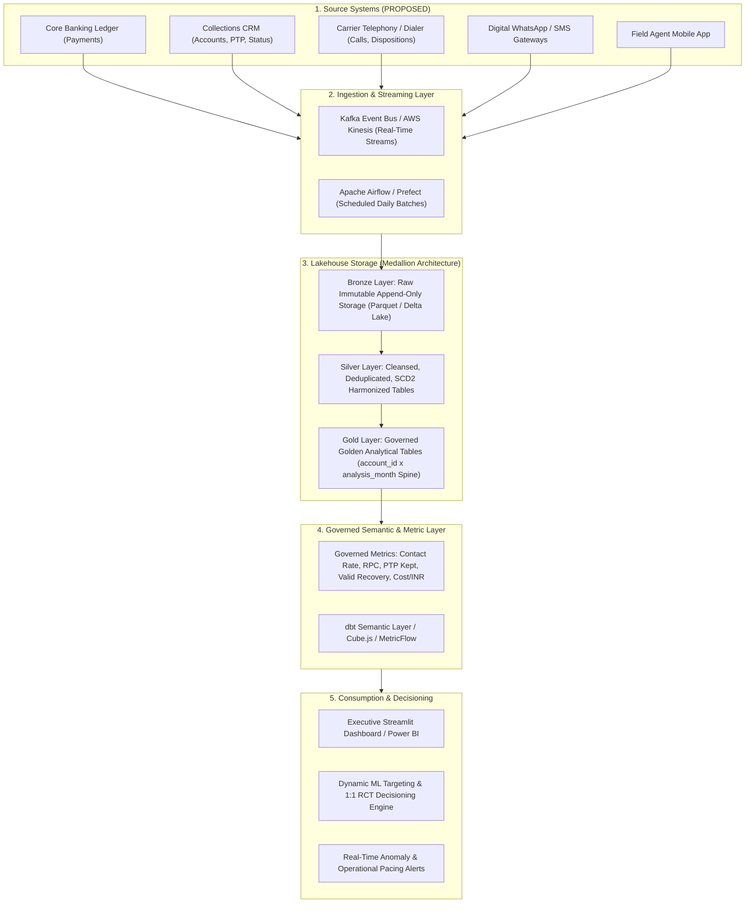

# Production Analytics Platform Architecture & Semantic Layer Specification

**Project**: Collections Recovery Analytics Platform  
**Phase**: 7 — Final Dashboard, Executive Memo & Production Analytics Architecture  
**Status**: APPROVED FOR ENTERPRISE IMPLEMENTATION  

---

## 1. Enterprise Architecture Overview



---

## 2. Granular Architectural Layers

### Layer 1: Ingestion & Data Contracts `[PROPOSED]`
- **Batch Ingestion**: Nightly incremental snapshots (at 01:00 IST) of core accounts, borrower master, and billing balances.
- **Streaming Ingestion**: Real-time webhook ingestion (sub-second latency) of call attempts, telephony dispositions, WhatsApp message receipts, and UPI payment settlement notifications.
- **Data Contracts**: Explicit JSONSchema / Protobuf validation rejecting malformed payloads before landing into Bronze storage.

### Layer 2: Medallion Lakehouse Storage
- **Bronze (Raw Immutable)**: Complete raw audit log preserving raw timestamps, source headers, and failed payloads.
- **Silver (Conformed & Cleansed)**:
  - Payment ledger deduplication on `payment_id`.
  - Exclusion of non-success transactions (`FAILED`, `PENDING`, `REVERSED`).
  - Canonical entity resolution for agents and borrowers using `updated_at` ordering.
  - Standardization of disposition taxonomies (`PROMISE_TO_PAY` → `PTP`).
- **Gold (Governed Analytical Layer)**:
  - Canonical Cartesian Spine: `account_id × analysis_month` (zero row multiplication).
  - Multi-window last-touch attribution (1-day, 7-day, 30-day lookback).

### Layer 3: Governed Semantic & Metric Layer
Every dashboard, SQL query, and ML model references a single unified dbt semantic model:
- **`valid_recovery_amount`**: $\sum 	ext{amount}$ where `payment_status == 'SUCCESS'` and `is_duplicate == FALSE`.
- **`portfolio_recovery_rate_pct`**: $rac{	ext{Count of Distinct Recovered Accounts}}{	ext{Total Portfolio Active Accounts}} 	imes 100$.
- **`contact_rate_pct`**: $rac{	ext{Count of Distinct Contacted Accounts}}{	ext{Count of Distinct Attempted Accounts}} 	imes 100$.
- **`rpc_rate_pct`**: $rac{	ext{Count of Distinct RPC Accounts}}{	ext{Count of Distinct Contacted Accounts}} 	imes 100$.
- **`ptp_rate_pct`**: $rac{	ext{Count of Distinct PTP Accounts}}{	ext{Count of Distinct RPC Accounts}} 	imes 100$.
- **`ptp_kept_rate_pct`**: $rac{	ext{Count of Distinct Kept PTP Accounts}}{	ext{Count of Distinct PTP Accounts}} 	imes 100$.

### Layer 4: ML Targeting & 1:1 RCT Experimentation Engine `[PROPOSED]`
```
Account Universe (30,000 Accounts)
       ↓
Dynamic ML Propensity Model (Scored Nightly on DPD, Balance, Touch History)
       ↓
Deterministic Hash Salt: hash(account_id, 'RCT_PILOT_2026_Q4') % 100
       ├── [0 – 49] (50%): Treatment Arm (Omnichannel WhatsApp -> SMS -> Paced Voice)
       └── [50 – 99] (50%): Control Arm (Standard Legacy Holdout)
       ↓
Outcome Logging & Causal Difference-in-Differences Estimation
```

---

## 3. Automated Monitoring, Alerting & SLAs

| Monitoring Dimension | Monitoring Metric | Warning Threshold | Critical Alert Threshold | Action Taken |
| :--- | :--- | :--- | :--- | :--- |
| **Pipeline Freshness** | Ingestion Delay | > 2 Hours past SLA | > 4 Hours past SLA | PagerDuty alert to Data On-Call; pipeline retry |
| **Data Quality** | Duplicate Payment Count | > 0 duplicate rows | > 10 duplicate rows | Block Silver-to-Gold promotion; notify Core Banking |
| **Payment Ledger** | Non-Success Infiltration | > 0% in Golden table | > 1% in Golden table | Quarantine payment batch; roll back analytics view |
| **Business Recovery** | Daily Net Collections Run-Rate | < ₹5.0M / day (-18%) | < ₹4.0M / day (-34%) | Alert Head of Collections & Finance VP |
| **PTP Execution** | Broken PTP Rate | > 80% break rate | > 85% break rate | Trigger conversational WhatsApp bot fallback |
| **Dialer Compliance** | Attempts / Account-Month | > 3 attempts | > 5 attempts | Auto-throttle telephony gateway; dialer freeze |

---

## 4. Platform Governance & Ownership Matrix

| Functional Role | Role Title | Primary Responsibility |
| :--- | :--- | :--- |
| **Data Platform Owner** | Head of Data Engineering | Lakehouse infrastructure, ingestion contracts, pipeline SLAs |
| **Metric Governance Owner** | Lead Analytics Engineer | dbt semantic models, metric definitions, denominator consistency |
| **Business Owner** | VP Collections Operations | Strategy execution, agent capacity, field deployment |
| **Targeting & ML Owner** | Lead Data Scientist | Propensity scoring models, RCT design, treatment assignment |
| **Dashboard Owner** | Senior BI Developer | Streamlit & BI visualization maintenance, dashboard freshness |
