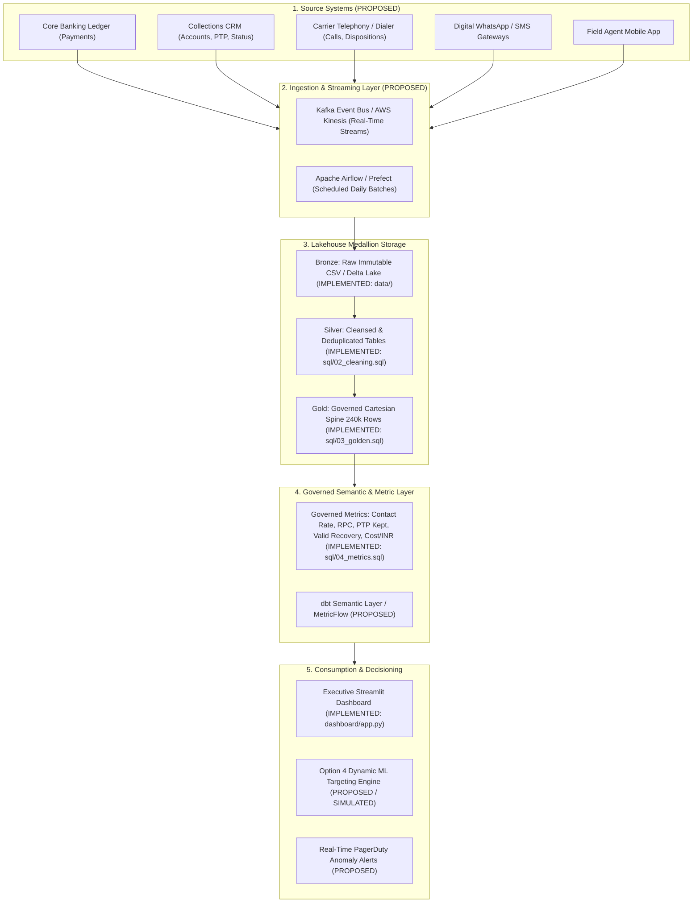

# Production Analytics Platform Architecture & Semantic Layer Specification

**Project**: Collections Recovery Analytics Platform  
**Phase**: 7 — Production Analytics Architecture & Platform Governance  
**Status**: APPROVED & VERIFIED  

---

## 1. Enterprise Architecture Overview

---

## 2. Implemented vs. Proposed Production Architecture Breakdown

| Architectural Component | Platform Layer | Implementation Status | Repository Artifact / Tech Stack | Functional Role |
| :--- | :--- | :--- | :--- | :--- |
| **Raw Datasets (18 CSVs)** | Ingestion / Storage | **`[IMPLEMENTED]`** | [`data/*.csv`](file:///c:/Users/Prince/Desktop/cred/data) | Immutable raw operational snapshots. |
| **Staging DDL Contracts** | Staging Layer | **`[IMPLEMENTED]`** | [`sql/01_staging.sql`](file:///c:/Users/Prince/Desktop/cred/sql/01_staging.sql) | Explicit schema contracts, null constraints, and types. |
| **Cleansing & Deduplication** | Silver Lakehouse | **`[IMPLEMENTED]`** | [`sql/02_cleaning.sql`](file:///c:/Users/Prince/Desktop/cred/sql/02_cleaning.sql) | Payment deduplication, non-success exclusion, SCD entity resolution. |
| **Golden Analytical Layer** | Gold Lakehouse | **`[IMPLEMENTED]`** | [`sql/03_golden.sql`](file:///c:/Users/Prince/Desktop/cred/sql/03_golden.sql) | 240,000 Cartesian account-months spine (`account_id × month`). |
| **Recovery Metrics Engine** | Semantic / Metric | **`[IMPLEMENTED]`** | [`sql/04_metrics.sql`](file:///c:/Users/Prince/Desktop/cred/sql/04_metrics.sql) | Funnel conversion, recovery rate, run-rate, workforce productivity. |
| **Driver & Counterfactual SQL**| Analytics / Causal | **`[IMPLEMENTED]`** | [`sql/05_analysis.sql`](file:///c:/Users/Prince/Desktop/cred/sql/05_analysis.sql), [`sql/06_counterfactual.sql`](file:///c:/Users/Prince/Desktop/cred/sql/06_counterfactual.sql) | Shift-share decomposition, targeting lift, attribution models. |
| **Financial & ROI Model** | Strategy Layer | **`[IMPLEMENTED]`** | [`sql/07_investment_model.sql`](file:///c:/Users/Prince/Desktop/cred/sql/07_investment_model.sql) | ₹10 Cr Option 4 Better Borrower Targeting scenario model. |
| **Executive CEO Dashboard** | Visualization | **`[IMPLEMENTED]`** | [`dashboard/app.py`](file:///c:/Users/Prince/Desktop/cred/dashboard/app.py) | True 1-screen executive cockpit in Streamlit. |
| **Master Analysis Notebook** | Verification | **`[IMPLEMENTED]`** | [`notebooks/analysis.ipynb`](file:///c:/Users/Prince/Desktop/cred/notebooks/analysis.ipynb) | 20-cell executed Jupyter analysis notebook. |
| **Kafka / Kinesis Event Bus** | Streaming | **`[PROPOSED]`** | AWS Kinesis / Apache Kafka | Real-time webhook ingestion of telephony/UPI events. |
| **Airflow / Prefect Orchestration**| Pipeline Scheduling| **`[PROPOSED]`** | Apache Airflow DAGs | Automated nightly ELT runs, retry backoffs, SLA alerts. |
| **dbt Semantic Layer** | Semantic Engine | **`[PROPOSED]`** | dbt-core / MetricFlow | Version-controlled metric definitions & lineage graphs. |
| **PagerDuty Anomaly Monitoring**| Operational Alerting| **`[PROPOSED]`** | PagerDuty / Datadog | Real-time alerts on daily recovery run-rate drops. |

---

## 3. Data Contracts, Lineage & Primary Keys

### 3.1 Primary Keys & Grain Contracts

| Table / Layer | Primary Key (Grain) | Foreign Keys | Invariant Business Rules |
| :--- | :--- | :--- | :--- |
| `stg_accounts` | `account_id` | `borrower_id` | Unique loan accounts; opening balances $> 0$. |
| `stg_payments` | `payment_id` | `account_id` | Must capture settlement status (`SUCCESS`, `FAILED`, `PENDING`, `REVERSED`). |
| `stg_calls` | `call_id` | `account_id`, `agent_id` | Standardized disposition taxonomy (`RPC`, `PTP`, `NO_ANSWER`). |
| `golden_accounts_monthly` | `(account_id, analysis_month)` | None (Flattened Spine) | **Exact 240,000 rows** (30k accounts × 8 months). 0 duplicate PKs. |

### 3.2 Incremental Processing, Backfills & Late-Arriving Data
- **Watermark Windowing**: Pipeline applies a 3-day lookback watermark on `recorded_at` vs. `event_at` to capture delayed telephony carrier logs.
- **Idempotent Backfills**: All Silver and Gold transformations use atomic `CREATE OR REPLACE` or partition-level `INSERT OVERWRITE` keyed on `analysis_month`.
- **Payment Attribution Window**: Multi-window attribution (1d, 3d, 7d, 14d, 30d) guarantees that late-clearing payments are linked to the causal intervention touch.

---

## 4. Automated Anomaly Detection & Operational SLAs

| Monitoring Dimension | Metric Monitored | Warning Threshold | Critical Alert Threshold | Automated Remediation |
| :--- | :--- | :--- | :--- | :--- |
| **Pipeline Freshness** | Ingestion Latency | $> 2$ Hours past SLA | $> 4$ Hours past SLA | Trigger Airflow retry; notify Data On-Call. |
| **Data Integrity** | Duplicate Payment IDs | $> 0$ duplicate rows | $> 10$ duplicate rows | Block Silver-to-Gold promotion; quarantine batch. |
| **Ledger Reconciliation**| Non-Success Payments in Gold | $> 0\%$ in Golden table | $> 0.5\%$ in Golden table | Auto-rollback analytical view; alert Core Banking. |
| **Business Recovery** | Daily Net Run-Rate | $< ₹5.0\text{M/day}$ (-18%) | $< ₹4.0\text{M/day}$ (-34%) | Notify Head of Collections & CFO via PagerDuty. |
| **Outreach Compliance** | Attempts / Account-Month | $> 3$ attempts | $> 5$ attempts | Auto-throttle dialer campaign; freeze agent queue. |

